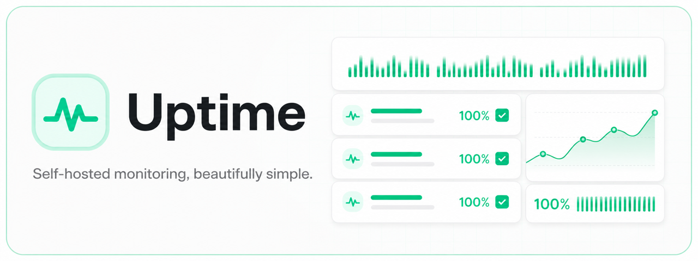
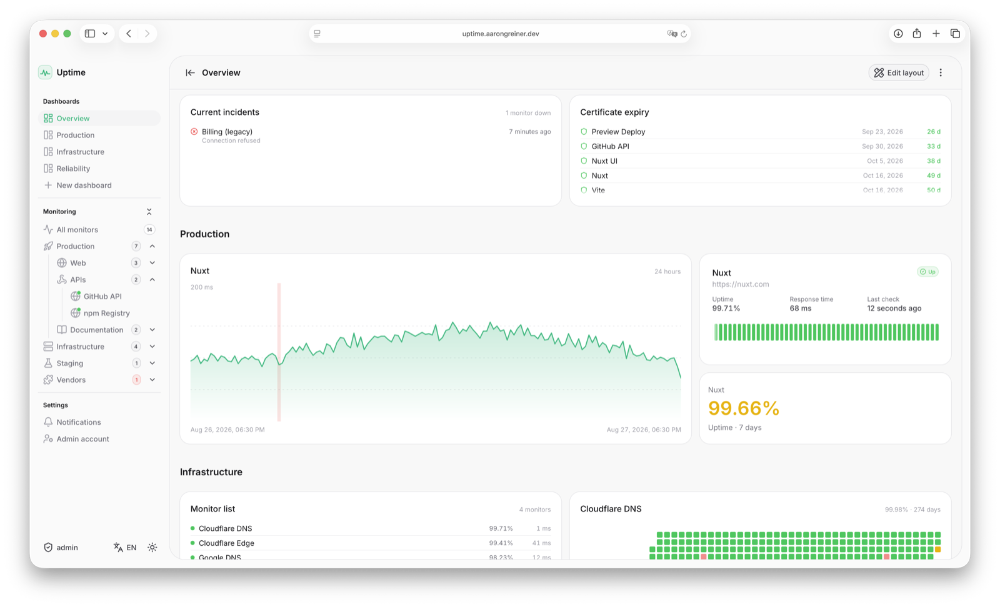

# Uptime

<picture>
  <source media="(prefers-color-scheme: dark)" srcset=".github/readme-hero-dark.png">
  <source media="(prefers-color-scheme: light)" srcset=".github/readme-hero-light.png">
  
</picture>

[](https://uptime.aarongreiner.dev)
[](https://github.com/AaronGreiner/uptime/tags)
[](https://github.com/AaronGreiner/uptime/pkgs/container/uptime)
[](./LICENSE)

A minimal, self-hosted uptime monitor with public, editable dashboards. Inspired
by Uptime Kuma, built with Nuxt 4, Nuxt UI 4, Bun and SQLite.

> [!TIP]
> **[Try the public demo →](https://uptime.aarongreiner.dev)**
>
> This is a shared testing instance, so feel free to explore, edit dashboards
> and try the admin features. Sign in as `admin`; finding the password is part
> of the demo. It is not a secret, and subtlety was not one of the requirements.
> Data may change or be reset at any time.

## Features

- **Public by default** — dashboards, monitor status and history are visible
  without an account; a single admin account manages the instance.
- **Editable dashboards** — combine live status, uptime, incidents, certificate
  expiry, response times and monitor lists into responsive layouts.
- **HTTP(S) and ping monitors** — status code ranges, keyword matching, custom
  headers, TLS certificate expiry and ICMP round trip times.
- **Nested groups** — organise monitors in a tree and scope dashboards or
  notifications to exactly the branch that needs them.
- **Incident and reliability history** — reconstruct outages, uptime, mean time
  to recovery and other reliability figures from recorded checks.
- **SMTP and Microsoft Teams notifications** — route events through reusable
  groups with retries and persistent delivery history.
- **Live everywhere** — server-sent events update cards, widgets, navigation and
  status figures together without refreshing the page.
- **Long history, small database** — raw checks roll into hourly aggregates and
  are pruned on a schedule.
- **Light and dark mode**, **English and German**.

## Preview

The preview follows your GitHub theme. Open the
[live demo](https://uptime.aarongreiner.dev) to try the interface yourself.

<picture>
  <source media="(prefers-color-scheme: dark)" srcset=".github/screenshots/dashboard-overview-dark.png">
  <source media="(prefers-color-scheme: light)" srcset=".github/screenshots/dashboard-overview-light.png">
  
</picture>

## Quick start

The container image is published for `linux/amd64` and `linux/arm64`, so a
Raspberry Pi works as well as a VPS. The host only needs Docker Engine.

```bash
docker run -d \
  --name uptime \
  --restart unless-stopped \
  -p 3000:3000 \
  -v uptime-data:/data \
  ghcr.io/aarongreiner/uptime:latest
```

Open http://localhost:3000. On the first start, Uptime creates the admin account.
If no password was configured, the generated password is printed exactly once:

```bash
docker logs uptime
```

### Docker Compose

The included Compose file keeps the installation in its own directory and makes
upgrades predictable:

```bash
mkdir uptime && cd uptime
curl -O https://raw.githubusercontent.com/AaronGreiner/uptime/main/docker-compose.yml
docker compose up -d
docker compose logs uptime
```

Put configuration overrides in a `.env` next to the Compose file. At minimum, a
public instance should set its origin:

```dotenv
NUXT_PUBLIC_APP_URL=https://uptime.example.com
```

See the [Docker deployment guide](./docs/docker.md) for reverse proxies, TLS,
upgrades, backups, ping permissions and building the image yourself.

## Configuration

Everything is configured through environment variables. See
[`.env.example`](./.env.example) for the annotated list.

| Variable | Default | Purpose |
| --- | --- | --- |
| `NUXT_SESSION_PASSWORD` | — | **Required.** Seals the admin session cookie, 32+ characters. Generated and stored beside the database in Docker. |
| `NUXT_SESSION_COOKIE_SECURE` | `true` | Marks the session cookie `Secure`. Must be `false` on a plain HTTP origin. |
| `NUXT_ADMIN_USERNAME` | `admin` | Username of the single admin account, seeded once. |
| `NUXT_ADMIN_PASSWORD` | *(empty)* | Admin password. Empty means a random one is generated and logged once. |
| `NUXT_PUBLIC_ACCOUNT_UPDATES_ENABLED` | `true` | Allow changing the admin username and password in Settings. Disable this on a shared demo. |
| `NUXT_DATABASE_PATH` | `./data/uptime.db` | SQLite file location. |
| `NUXT_MIGRATIONS_DIR` | `./drizzle` | Folder holding the generated migrations. |
| `NUXT_SCHEDULER_ENABLED` | `true` | Set to `false` to run the UI without executing checks. |
| `NUXT_SCHEDULER_CONCURRENCY` | `10` | Checks running in parallel. |
| `NUXT_SCHEDULER_TICK_INTERVAL_MS` | `1000` | How often due monitors are picked up. |
| `NUXT_RETENTION_HEARTBEAT_DAYS` | `7` | Days of raw per-check results to keep. |
| `NUXT_RETENTION_HOURLY_STATS_DAYS` | `365` | Days of hourly aggregates to keep. |
| `NUXT_RETENTION_NOTIFICATION_DAYS` | `30` | Days of notification delivery history to keep. |
| `NUXT_NOTIFICATIONS_ENABLED` | `true` | Set to `false` to queue notifications without delivering them. |
| `NUXT_SEED_DEMO_DATA` | `false` | Seed demo monitors and showcase dashboards. See below. |
| `NUXT_SEED_DEMO_HISTORY_DAYS` | `7` | Days of generated history for the demo monitors. |
| `NUXT_PUBLIC_APP_NAME` | `Uptime` | Name shown in the header and page titles. |
| `NUXT_PUBLIC_APP_URL` | *(empty)* | Public origin of this instance. Notification links need it; in Docker it also decides the cookie flag above. |

Credentials can also be changed later in the UI under **Settings** unless
`NUXT_PUBLIC_ACCOUNT_UPDATES_ENABLED` is set to `false`.

### Demo data

Setting `NUXT_SEED_DEMO_DATA=true` seeds fourteen monitors, three pre-built
dashboards and generated history, so the interface has something to show
immediately.

- It runs **at most once**, and only on a database that has no monitors yet.
- The demo monitors point at **real public endpoints** (`nuxt.com`,
  `api.github.com`, `1.1.1.1`, `example.com`). Enabling this sends actual requests
  to those hosts.
- Turning the flag back off does not remove anything already seeded. Use the
  data controls in **Settings** or start from a fresh database file.

Leave it at `false` for a real deployment.

#### Local demo login

Put this in `.env` to get a populated local instance with a known login:

```dotenv
NUXT_SESSION_PASSWORD=local-development-session-password-32
NUXT_ADMIN_USERNAME=admin
NUXT_ADMIN_PASSWORD=devpassword123
NUXT_SEED_DEMO_DATA=true
```

Then run `bun run dev` and sign in at http://localhost:3000/login with username
`admin` and password `devpassword123`.

> [!WARNING]
> These credentials are for the local demo only. Never use them on a reachable
> instance: choose your own `NUXT_ADMIN_PASSWORD` and a random
> `NUXT_SESSION_PASSWORD`, or use the password generated on first start.

## How it works

### Monitor types

**HTTP(S)** checks a URL and passes when the status code falls inside the
accepted range, for example `200-299,301`. It can require or reject a keyword,
send custom headers and a body, control redirects and track TLS certificate
expiry.

**Ping** sends ICMP echo requests through the system `ping` binary and records
the average round trip time. A check passes when at least one reply comes back;
packet loss is reported in the result message.

Both types share the check interval, timeout and retry settings. While retries
remain, a failed monitor is *pending* rather than *down*, keeping single blips
out of the incident history.

### History and storage

Every check writes one row to `heartbeats`. A maintenance job rolls those rows
into hourly buckets and prunes data past its retention window. Ranges up to 24
hours read raw rows; longer ranges read the aggregates. This keeps a year of
history in a small SQLite database.

## Development

Install [Bun](https://bun.sh/) 1.3.9 or newer, then:

```bash
bun install
cp .env.example .env
openssl rand -base64 32
```

Put the generated value in `.env` as `NUXT_SESSION_PASSWORD`, then start the
development server:

```bash
bun run dev
```

The application is available at http://localhost:3000.

```bash
bun run build        # production build into .output
bun run typecheck    # vue-tsc across app, server and shared code
bun run lint         # eslint
bun run db:generate  # create a migration after changing the schema
bun run db:studio    # browse the database
```

Migrations run automatically at boot. Architecture notes, conventions and
extension points are in [AGENTS.md](./AGENTS.md).

## Maintainer deployment

A `v*` tag publishes the container image and deploys the hosted instance through
separate GitHub Actions workflows. The server deployment builds with Bun,
uploads `.output/` and `drizzle/`, backs up SQLite, restarts systemd and rolls
back when the health check fails. See the [deployment runbook](./deploy/RUNBOOK.md)
for setup, secrets and recovery steps.

## Contributing

Issues and pull requests are welcome. Before opening a pull request, run
`bun run typecheck` and `bun run lint`. Keep code and documentation in English,
and add every user-facing string to both locale files.

## AI disclosure

> [!NOTE]
> This project was created by **Aaron Greiner** in collaboration with AI tools,
> including **Claude by Anthropic** and **ChatGPT by OpenAI**. AI assisted with
> implementation, review, documentation and problem-solving; the project is
> directed, curated and maintained by its human author.

## License

[MIT License](./LICENSE)
